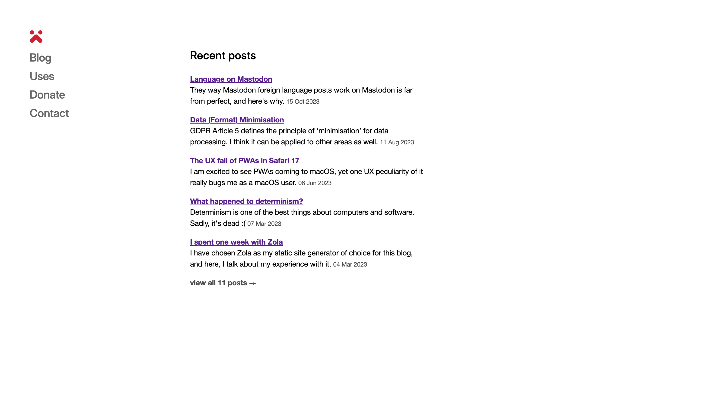

# Andersson

Andersson is a very minimalistic theme for Zola. I've used it on the v8 of my personal website.



## Install

In the root of your Zola site:

```sh
cd themes
git clone https://github.com/kytta/andersson
```

Then, in your `config.toml`:

```toml
theme = "andersson"
```

## `[extra]` options

The only available option is `menu`. It is a list that accepts objects with two properties:

- `path` — path to the page
- `type` — either `page` or `section`

The title of the menu entry will be chose automatically.

## Credits

I took a lot of design inspiration from [Rasmus Andersson](https://rsms.me/)'s personal website. He also' created the [Inter](https://rsms.me/inter/) typeface that this theme uses.

[FrontAid CMS](https://frontaid.io/) created the [Natural Selection](https://github.com/frontaid/natural-selection) CSS framework which this theme uses.

[Linus](https://github.com/linuskmr) taught me how to make use of the browser's dark theme with one line of code.

## License

© 2023 [Nikita Karamov]\
Code licensed under the [ISC License].\
Content licensed under the [CC-BY-SA 4.0].

---

This project is hosted on GitHub:
<https://github.com/kytta/andersson.git>

[cc-by-sa 4.0]: https://spdx.org/licenses/CC-BY-SA-4.0.html
[isc license]: https://spdx.org/licenses/ISC.html
[nikita karamov]: https://www.kytta.dev/
